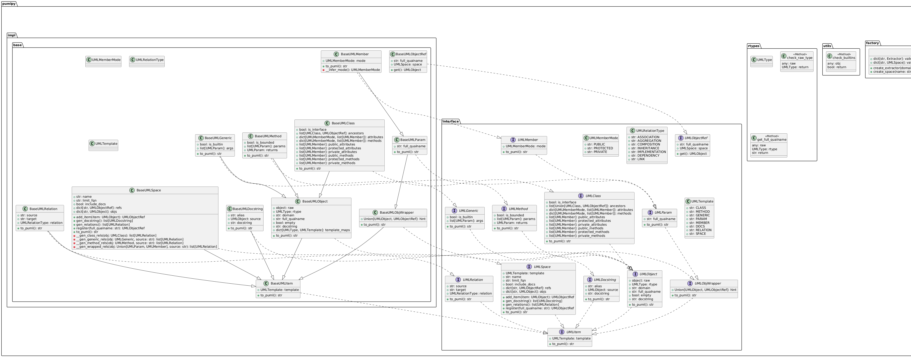

# PumlPY

PumlPY is a Python library for generating PlantUML diagrams from code.

## 1. Developers README

[Develop Docs](./pumlpy/DEV.md)

## 2. Setup Guide

### 2.1 System Requirements

- Python 3.11+
- GraphViz
- OpenJDK 18+
- VSCode with Python extension and PlantUML extension

If you don't want to install visilize tools in your device, you can use [PlantUML online service](https://www.plantuml.com/plantuml/uml/SyfFKj2rKt3CoKnELR1Io4ZDoSa70000).

Then you just need:

- Python 3.11+

### 2.2 Installation

```bash
git clone https://github.com/Koko12137/pumlpy.git
cd /your/path/pumlpy
pip install -e ./
```

### 2.3 Usage

```bash
pumlpy --help
```

Output Example: (The help message)
```bash
Usage: pumlpy [OPTIONS] PATH

  Entry point for the command-line interface. This will extract the package
  hierarchy from the given path and  generate PlantUML code that can be used
  to generate a diagram.

  Args:
      path (str): 
          The path to the package or folder to be processed.
      output (str, optional): 
          The path to the output file. Defaults to None. 
      replace (bool):
          Whether to replace the output file if it already exists. Defaults to False. 
      limit_fqn (str, optional): 
          The fully qualified name of the root element to be extracted. Defaults to ''. 
      include_extern (bool, optional): 
          Whether or not to include extern definitions. Defaults to False. 
      include_docs (bool, optional): 
          Whether to include docstring for each object. Defaults to False. 
      max_depth (int): 
          The maximum depth of the package hierarchy to be processed.

  Returns:
      None

  Raises:
      ValueError: 
          If the output file already exists and replace is False. 

Options:
  --output PATH        The path to the output file.
  --replace            Whether to replace the output file if it already
                       exists.
  --limit-fqn TEXT     The fully qualified name of the root element to be
                       extracted.
  --include-extern     Whether or not to include extern definitions.
  --include-docs       Whether to include docstring for each object.
  --max-depth INTEGER  The maximum depth of the package hierarchy to be
                       processed.
  --help               Show this message and exit.
```

## 3. Examples

Inspect pumlpy/pumlpy

```bash
cd /your/path/to/pumlpy     

pumlpy ./pumlpy --output ./examples/pumlpy.puml
```

Visualized Output:


