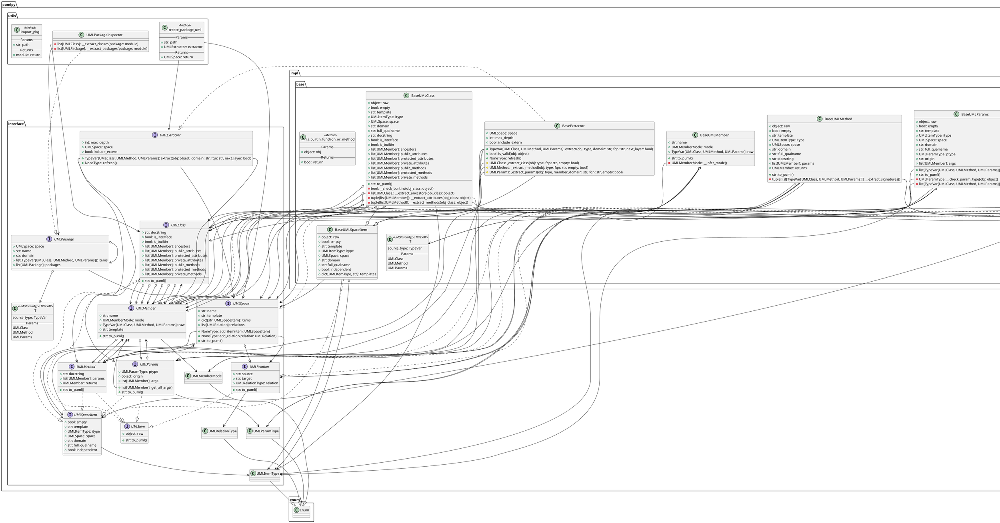

# Project pumlpy develop guide

Coming soon...

## Run Example

```bash
python main.py
```

Result:


```plantuml
@startuml       pumlpy

Interface pumlpy.interface.UMLExtractor {
        + int: max_depth
        + UMLSpace: space
        + bool: include_extern
        + TypeVar[UMLClass, UMLMethod, UMLParams]: extract(obj: object, domain: str, fqn: str, next_layer: bool)
        + NoneType: refresh()
}
Interface pumlpy.interface.UMLSpace {
        + str: name
        + str: template
        + dict[str, UMLSpaceItem]: items
        + list[UMLRelation]: relations
        + NoneType: add_item(item: UMLSpaceItem)
        + NoneType: add_relation(relation: UMLRelation)
        + str: to_puml()
}
Interface pumlpy.interface.UMLClass {
        + str: docstring
        + bool: is_interface
        + bool: is_builtin
        + list[UMLMember]: ancestors
        + list[UMLMember]: public_attributes
        + list[UMLMember]: protected_attributes
        + list[UMLMember]: private_attributes
        + list[UMLMember]: public_methods
        + list[UMLMember]: protected_methods
        + list[UMLMember]: private_methods
        + str: to_puml()
}
Interface pumlpy.interface.UMLMethod {
        + str: docstring
        + list[UMLMember]: params
        + UMLMember: returns
        + str: to_puml()
}
Interface pumlpy.interface.UMLParams {
        + UMLParamType: ptype
        + object: origin
        + list[UMLMember]: args
        + list[UMLMember]: get_all_args()
        + str: to_puml()
}
Class pumlpy.impl.base.BaseExtractor {
        + UMLSpace: space
        + int: max_depth
        + bool: include_extern
        + TypeVar[UMLClass, UMLMethod, UMLParams]: extract(obj: type, domain: str, fqn: str, next_layer: bool)
        + bool: is_valid(obj: object)
        + NoneType: refresh()
        # UMLClass: _extract_class(obj: type, fqn: str, empty: bool)
        # UMLMethod: _extract_method(obj: type, fqn: str, empty: bool)
        # UMLParams: _extract_params(obj: type, member_domain: str, fqn: str, empty: bool)
}
Class pumlpy.impl.base.BaseUMLSpaceItem {
        + object: raw
        + bool: empty
        + str: template
        + UMLItemType: itype
        + UMLSpace: space
        + str: domain
        + str: full_qualname
        + bool: independent
        + dict[UMLItemType, str]: templates

}
Class pumlpy.interface.UMLItemType {


}
Interface pumlpy.interface.UMLMember {
        + str: name
        + UMLMemberMode: mode
        + TypeVar[UMLClass, UMLMethod, UMLParams]: raw
        + str: template
        + str: to_puml()
}
Class pumlpy.impl.base.BaseUMLClass {
        + object: raw
        + bool: empty
        + str: template
        + UMLItemType: itype
        + UMLSpace: space
        + str: domain
        + str: full_qualname
        + str: docstring
        + bool: is_interface
        + bool: is_builtin
        + list[UMLMember]: ancestors
        + list[UMLMember]: public_attributes
        + list[UMLMember]: protected_attributes
        + list[UMLMember]: private_attributes
        + list[UMLMember]: public_methods
        + list[UMLMember]: protected_methods
        + list[UMLMember]: private_methods
        + str: to_puml()
        - bool: __check_builtins(obj_class: object)
        - list[UMLClass]: __extract_ancestors(obj_class: object)
        - tuple[list[UMLMember]]: __extract_attributes(obj_class: object)
        - tuple[list[UMLMethod]]: __extract_methods(obj_class: object)
}
Class pumlpy.interface.UMLMemberMode {


}
Class pumlpy.impl.base.BaseUMLMember {
        + str: name
        + UMLMemberMode: mode
        + TypeVar[UMLClass, UMLMethod, UMLParams]: raw
        + str: to_puml()
        - UMLMemberMode: __infer_mode()
}
Class pumlpy.impl.base.BaseUMLMethod {
        + object: raw
        + bool: empty
        + str: template
        + UMLItemType: itype
        + UMLSpace: space
        + str: domain
        + str: full_qualname
        + str: docstring
        + list[UMLMember]: params
        + UMLMember: returns
        + str: to_puml()
        - tuple[list[TypeVar[UMLClass, UMLMethod, UMLParams]]]: __extract_signatures()
}
Class pumlpy.interface.UMLParamType {


}
Class pumlpy.impl.base.BaseUMLParams {
        + object: raw
        + bool: empty
        + str: template
        + UMLItemType: itype
        + UMLSpace: space
        + str: domain
        + str: full_qualname
        + UMLParamType: ptype
        + str: origin
        + list[UMLMember]: args
        + list[TypeVar[UMLClass, UMLMethod, UMLParams]]: get_all_args()
        + str: to_puml()
        - UMLParamType: __check_param_type(obj: object)
        - list[TypeVar[UMLClass, UMLMethod, UMLParams]]: __extract_args()
}
Interface pumlpy.interface.UMLRelation {
        + str: source
        + str: target
        + UMLRelationType: relation
        + str: to_puml()
}
Class pumlpy.impl.base.BaseUMLRelation {

        + NoneType: register()
        + str: to_puml()
}
Interface pumlpy.interface.UMLSpaceItem {
        + bool: empty
        + str: template
        + UMLItemType: itype
        + UMLSpace: space
        + str: domain
        + str: full_qualname
        + bool: independent

}
Class pumlpy.impl.base.BaseUMLSpace {
        + str: name
        + str: template
        + dict[str, UMLSpaceItem]: items
        + list[UMLRelation]: relations
        + NoneType: add_item(obj_class: UMLMethod]:: Union[UMLClass)
        + NoneType: add_relation(relation: UMLRelation)
        + str: to_puml()
}
Class pumlpy.impl.base.T << UMLParamType.TYPEVAR >> {
         source_type: TypeVar
        --Params--
UMLClass
UMLMethod
UMLParams
}
Class pumlpy.impl.base.is_builtin_function_or_method << Method >> {
        --Params--
        + object: obj
        --Returns--
        + bool: return
}
Class pumlpy.interface.T << UMLParamType.TYPEVAR >> {
         source_type: TypeVar
        --Params--
UMLClass
UMLMethod
UMLParams
}
Interface pumlpy.interface.UMLItem {
        + object: raw
        + str: to_puml()
}
Interface pumlpy.interface.UMLPackage {
        + UMLSpace: space
        + str: name
        + str: domain
        + list[TypeVar[UMLClass, UMLMethod, UMLParams]]: items
        + list[UMLPackage]: packages

}
Class pumlpy.interface.UMLRelationType {


}
Class pumlpy.utils.UMLPackageInspector {

        - list[UMLClass]: __extract_classes(package: module)
        - list[UMLPackage]: __extract_packages(package: module)
}
Class pumlpy.utils.create_package_uml << Method >> {
        --Params--
        + str: path
        + UMLExtractor: extractor
        --Returns--
        + UMLSpace: return
}
Class pumlpy.utils.import_pkg << Method >> {
        --Params--
        + str: path
        --Returns--
        + module: return
}

pumlpy.impl.base.BaseExtractor ..|> pumlpy.interface.UMLExtractor
pumlpy.impl.base.BaseExtractor --> pumlpy.interface.UMLSpace
pumlpy.impl.base.BaseExtractor::_extract_class --> pumlpy.interface.UMLClass
pumlpy.impl.base.BaseExtractor::_extract_method --> pumlpy.interface.UMLMethod
pumlpy.impl.base.BaseExtractor::_extract_params --> pumlpy.interface.UMLParams
pumlpy.impl.base.BaseExtractor::extract --> pumlpy.interface.UMLClass
pumlpy.impl.base.BaseExtractor::extract --> pumlpy.interface.UMLMethod
pumlpy.impl.base.BaseExtractor::extract --> pumlpy.interface.UMLParams
pumlpy.impl.base.BaseUMLClass --|> pumlpy.impl.base.BaseUMLSpaceItem
pumlpy.impl.base.BaseUMLClass ..|> pumlpy.interface.UMLClass
pumlpy.impl.base.BaseUMLClass --> pumlpy.interface.UMLItemType
pumlpy.impl.base.BaseUMLClass --> pumlpy.interface.UMLSpace
pumlpy.impl.base.BaseUMLClass o--> pumlpy.interface.UMLMember
pumlpy.impl.base.BaseUMLClass o--> pumlpy.interface.UMLMember
pumlpy.impl.base.BaseUMLClass o--> pumlpy.interface.UMLMember
pumlpy.impl.base.BaseUMLClass o--> pumlpy.interface.UMLMember
pumlpy.impl.base.BaseUMLClass o--> pumlpy.interface.UMLMember
pumlpy.impl.base.BaseUMLClass o--> pumlpy.interface.UMLMember
pumlpy.impl.base.BaseUMLClass o--> pumlpy.interface.UMLMember
pumlpy.impl.base.BaseUMLClass::__extract_ancestors --> pumlpy.interface.UMLClass
pumlpy.impl.base.BaseUMLClass::__extract_attributes --> builtins.list
pumlpy.impl.base.BaseUMLClass::__extract_methods --> builtins.list
pumlpy.impl.base.BaseUMLMember ..|> pumlpy.interface.UMLMember
pumlpy.impl.base.BaseUMLMember --> pumlpy.interface.UMLMemberMode
pumlpy.impl.base.BaseUMLMember o--> pumlpy.interface.UMLClass
pumlpy.impl.base.BaseUMLMember o--> pumlpy.interface.UMLMethod
pumlpy.impl.base.BaseUMLMember o--> pumlpy.interface.UMLParams
pumlpy.impl.base.BaseUMLMember::__infer_mode --> pumlpy.interface.UMLMemberMode
pumlpy.impl.base.BaseUMLMethod --|> pumlpy.impl.base.BaseUMLSpaceItem
pumlpy.impl.base.BaseUMLMethod ..|> pumlpy.interface.UMLMethod
pumlpy.impl.base.BaseUMLMethod --> pumlpy.interface.UMLItemType
pumlpy.impl.base.BaseUMLMethod --> pumlpy.interface.UMLSpace
pumlpy.impl.base.BaseUMLMethod o--> pumlpy.interface.UMLMember
pumlpy.impl.base.BaseUMLMethod --> pumlpy.interface.UMLMember
pumlpy.impl.base.BaseUMLMethod::__extract_signatures --> builtins.callable
pumlpy.impl.base.BaseUMLMethod::__extract_signatures --> builtins.list
pumlpy.impl.base.BaseUMLParams --|> pumlpy.impl.base.BaseUMLSpaceItem
pumlpy.impl.base.BaseUMLParams ..|> pumlpy.interface.UMLParams
pumlpy.impl.base.BaseUMLParams --> pumlpy.interface.UMLItemType
pumlpy.impl.base.BaseUMLParams --> pumlpy.interface.UMLSpace
pumlpy.impl.base.BaseUMLParams --> pumlpy.interface.UMLParamType
pumlpy.impl.base.BaseUMLParams o--> pumlpy.interface.UMLMember
pumlpy.impl.base.BaseUMLParams::__check_param_type --> pumlpy.interface.UMLParamType
pumlpy.impl.base.BaseUMLParams::__extract_args --> pumlpy.impl.base.T
pumlpy.impl.base.BaseUMLParams::get_all_args --> pumlpy.impl.base.T
pumlpy.impl.base.BaseUMLRelation ..|> pumlpy.interface.UMLRelation
pumlpy.impl.base.BaseUMLSpace ..|> pumlpy.interface.UMLSpace
pumlpy.impl.base.BaseUMLSpace o--> pumlpy.interface.UMLSpaceItem
pumlpy.impl.base.BaseUMLSpace o--> pumlpy.interface.UMLRelation
pumlpy.impl.base.BaseUMLSpace::add_item --> pumlpy.interface.UMLClass
pumlpy.impl.base.BaseUMLSpace::add_item --> pumlpy.interface.UMLMethod
pumlpy.impl.base.BaseUMLSpace::add_relation --> pumlpy.interface.UMLRelation
pumlpy.impl.base.BaseUMLSpaceItem ..|> pumlpy.interface.UMLSpaceItem
pumlpy.impl.base.BaseUMLSpaceItem --> pumlpy.interface.UMLItemType
pumlpy.impl.base.BaseUMLSpaceItem --> pumlpy.interface.UMLSpace
pumlpy.impl.base.BaseUMLSpaceItem o--> pumlpy.interface.UMLItemType
pumlpy.interface.UMLClass ..|> pumlpy.interface.UMLItem
pumlpy.interface.UMLClass ..|> pumlpy.interface.UMLSpaceItem
pumlpy.interface.UMLClass o--> pumlpy.interface.UMLMember
pumlpy.interface.UMLClass o--> pumlpy.interface.UMLMember
pumlpy.interface.UMLClass o--> pumlpy.interface.UMLMember
pumlpy.interface.UMLClass o--> pumlpy.interface.UMLMember
pumlpy.interface.UMLClass o--> pumlpy.interface.UMLMember
pumlpy.interface.UMLClass o--> pumlpy.interface.UMLMember
pumlpy.interface.UMLClass o--> pumlpy.interface.UMLMember
pumlpy.interface.UMLExtractor --> pumlpy.interface.UMLSpace
pumlpy.interface.UMLExtractor::extract --> pumlpy.interface.UMLClass
pumlpy.interface.UMLExtractor::extract --> pumlpy.interface.UMLMethod
pumlpy.interface.UMLExtractor::extract --> pumlpy.interface.UMLParams
pumlpy.interface.UMLItemType --|> enum.Enum
pumlpy.interface.UMLMember --> pumlpy.interface.UMLMemberMode
pumlpy.interface.UMLMember o--> pumlpy.interface.UMLClass
pumlpy.interface.UMLMember o--> pumlpy.interface.UMLMethod
pumlpy.interface.UMLMember o--> pumlpy.interface.UMLParams
pumlpy.interface.UMLMemberMode --|> enum.Enum
pumlpy.interface.UMLMethod ..|> pumlpy.interface.UMLItem
pumlpy.interface.UMLMethod ..|> pumlpy.interface.UMLSpaceItem
pumlpy.interface.UMLMethod o--> pumlpy.interface.UMLMember
pumlpy.interface.UMLMethod --> pumlpy.interface.UMLMember
pumlpy.interface.UMLPackage --> pumlpy.interface.UMLSpace
pumlpy.interface.UMLPackage o--> pumlpy.interface.T
pumlpy.interface.UMLPackage o--> pumlpy.interface.UMLPackage
pumlpy.interface.UMLParamType --|> enum.Enum
pumlpy.interface.UMLParams ..|> pumlpy.interface.UMLItem
pumlpy.interface.UMLParams ..|> pumlpy.interface.UMLSpaceItem
pumlpy.interface.UMLParams --> pumlpy.interface.UMLParamType
pumlpy.interface.UMLParams o--> pumlpy.interface.UMLMember
pumlpy.interface.UMLParams::get_all_args --> pumlpy.interface.UMLMember
pumlpy.interface.UMLRelation ..|> pumlpy.interface.UMLItem
pumlpy.interface.UMLRelation --> pumlpy.interface.UMLRelationType
pumlpy.interface.UMLRelationType --|> enum.Enum
pumlpy.interface.UMLSpace o--> pumlpy.interface.UMLSpaceItem
pumlpy.interface.UMLSpace o--> pumlpy.interface.UMLRelation
pumlpy.interface.UMLSpace::add_item --> pumlpy.interface.UMLSpaceItem
pumlpy.interface.UMLSpace::add_relation --> pumlpy.interface.UMLRelation
pumlpy.interface.UMLSpaceItem --> pumlpy.interface.UMLItemType
pumlpy.interface.UMLSpaceItem --> pumlpy.interface.UMLSpace
pumlpy.utils.UMLPackageInspector ..|> pumlpy.interface.UMLPackage
pumlpy.utils.UMLPackageInspector::__extract_classes --> pumlpy.interface.UMLClass
pumlpy.utils.UMLPackageInspector::__extract_packages --> pumlpy.interface.UMLPackage
pumlpy.utils.create_package_uml --> pumlpy.interface.UMLExtractor
pumlpy.utils.create_package_uml --> pumlpy.interface.UMLSpace

@enduml
```
